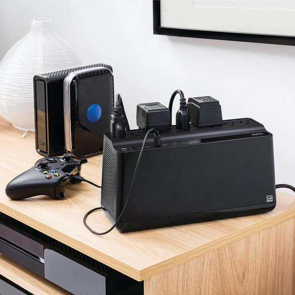

# APCUPS
Instructions how to install and configure a APC UPS for Rocket Pool Node Operators. 

# Introduction

If you have an APC UPS, another option is to use apcupsd, which is a more advanced tool to manage your APC UPS.  The package apcupsd provides a daemon which will monitor your APC UPS, and shutdown the system when power is no longer being supplied to the UPS.  An APC UPS. The apcupsd daemon works with most APC Smart-UPS models, as well as most simple signaling models, such as Back-UPS, and BackUPS-Office.


## Example Installation for a NUC8i5 model


For my installation I chose a APC UPS Battery Backup and Surge Protector, 600VA Backup Battery Power Supply, BE600M1 Back-UPS with USB Charger Port that retails for ~$65 on Amazon. (https://www.amazon.com/gp/product/B01FWAZEIU/). My goal was not to withstand long-duration power outage but rather maintain operattion during a short-term power interperation of 1 hour or less.  APC provides a useful tool to calculate the corect size of UPS needed if you supply it with your devide power consumption and desirede UPS run-time duration. 


## Installation Instructions

### apcupsd Installation

1. Follow the installation instructions in the UPS package or installing the battery and preparing the UPS for first use. 
1. Plug the server, NAT/Router and your ISP modem in to the UPS powered plugs on the UPS. Note that two of the plugs are NOT battery protected and are only surge-protected plugs. (I will use those for a future power retore wathcdog ESP8266 IoT to reboot the NUC after mains power has been restored. More to come on this project. )

1. Power up the devices. 


<br>

### Format the Secure Key


1. Install the apcupsd package via a terminal:

    ```
    sudo apt-get -y install apcupsd
     ```
1. Backup the original configuration files:
     ```
    sudo cp /etc/apcupsd/apcupsd.conf /etc/apcupsd/apcupsd.conf.bak
     ```
1. Edit the configuration files:
     ```
     sudo nano /etc/apcupsd/apcupsd.conf
     ```
     Scroll thru the document and alter the follwing settings:
      ```
      UPSNAME smartups750
      UPSCABLE usb
      UPSTYPE usb
      DEVICE 
      POLLTIME 60
     ```
1. Backup the original configuration files:
     ```
    sudo cp /etc/default/apcupsd /etc/default/apcupsd.bak
     ```
1. Edit the configuration files:
     ```
     sudo nano /etc/default/apcupsd
     ```
     Scroll thru the document and alter the follwing settings:
      ```
      ISCONFIGURED=yes
      ```


 
 <br>
 
 ### Verify that apcupsd is working.

1. Verify that the daemond is propwerly running in systemctl
    ```
    sudo systemctl status apcupsd.service
    ```
    It should display "active (running)" in green text. 

1. Verify that you can obtain the status of the UPS and that the configured setting are displayed. 
    ```
   sudo apcaccess status
    ```

<br>

### Configure the UPS Settings
    
### Installing an APACHE webserver  (optional)

1. Install the apcupsd package via a terminal:
    ```
    sudo apt-get -y install apcupsd
     ```
1. Backup the original configuration files:
     ```
    sudo cp /etc/apcupsd/apcupsd.conf /etc/apcupsd/apcupsd.conf.bak
     ```

Via Command Line Interface

Via a web browser
